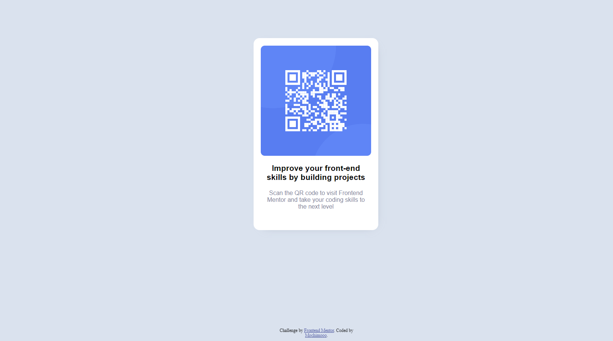

# Frontend Mentor QR code challenge
 My first project attempt
 Date started:1/10/2023
 Date finished: 1/23/2023

## Table of contents

- [Overview](#overview)
  - [Screenshot](#screenshot)
  - [Links](#links)
- [My process](#my-process)
  - [Built with](#built-with)
  - [What I learned](#what-i-learned)
  - [Continued development](#continued-development)
  - [Useful resources](#useful-resources)
- [Author](#author)
- [Acknowledgments](#acknowledgments)

## Overview

### Screenshot

## My process

### Built with

- Semantic HTML5 markup
- CSS custom properties

### Continued development

This is the first project I ever made with HTML 5 and CSS. Definitely need practice to remember how to use some of the functions here, including: how to insert font from an URL, fix footer at the bottom of the page so it's readable across different monitor screen sizes, how to make a card and how to make it look dimesional, etc.

### Useful resources

- [How to Center an Image Using Text Align: Center](https://www.freecodecamp.org/news/how-to-center-an-image-using-text-align/) - This helped me center the QR code within the card.
- [CSS Box-Shadow tutorial: the basics](https://www.youtube.com/watch?v=-JNRQ5HjNeI&ab_channel=KevinPowell) - The video explains how to create shadow around a box-in this case it's the card.
- [How to set background color in HTML?](https://www.tutorialspoint.com/How-to-set-background-color-in-HTML) - The article explains how to set background color for HTML body in HTML or with CSS.
- [CSS Rounded Corners](https://www.w3schools.com/css/css3_borders.asp) - info for how to set the card's corners to be rounded.
- [How to add CSS] (https://www.w3schools.com/css/css_howto.asp) - info for how to create external, internal, or inline CSS. I plan to learn about how to make external CSS sheet so I can save time in the future.
- [How to Host a Website on GitHub Pages](https://www.youtube.com/watch?app=desktop&v=I-yT2Err6PE&ab_channel=KahanDataSolutions) - This tutorial video taught me how to host my solution website on GitHub.

## Author
- Frontend Mentor - [@mochimooo](https://www.frontendmentor.io/profile/mochimooo)

## Acknowledgments

I got help from my brother, Benny. He gave me feedback which I will implement in my future projects, such as creating an external CSS sheet, and how to consider the functionality of a website in order to fix certain items on the website to fit different monitor screens.
